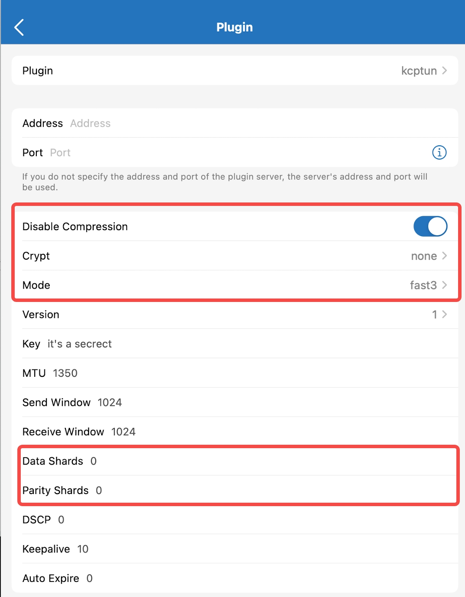

# kcptun-sip003-rust

A [kcptun](https://github.com/xtaci/kcptun) implementation in Rust with sip003 support. It combines:
- A hacked version of [tokio_kcp](https://github.com/Matrix-Zhang/tokio_kcp/)
- [tokio_smux](https://github.com/oyyd/tokio_smux).

Currently, only minimal features of kcptun are implemented. To work with kcptun, please set these options:

```bash
--crypt none --mode fast3 --nocomp --ps 0 --ds 0
```

Example:




## Install

```bash
git clone https://github.com/oyyd/kcptun-sip003-rust.git
cd kcptun-sip003-rust
cargo install --path .
kcptun-sip003-rust
```


## Usage

Start a server:
```bash
kcptun-sip003-rust
```

Start a client:
```bash
SS_PLUGIN_OPTIONS="client=true" kcptun-sip003-rust
```
